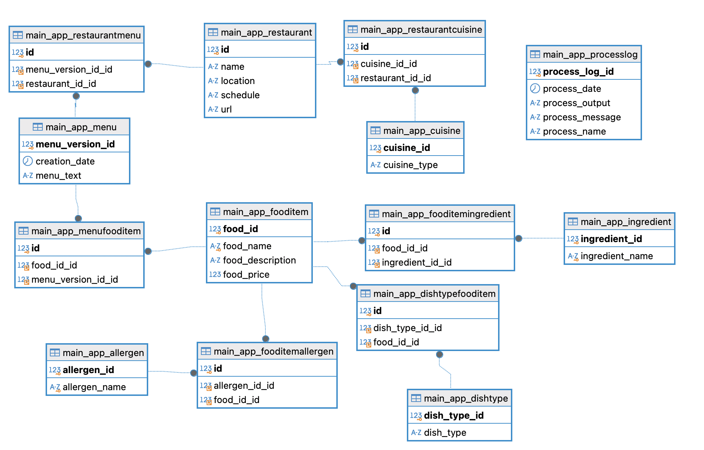

# Menu Relational Database Management System

If you want to see the project with frontend, clone the repo below and follow the instructions in the frontend README.md file.
The repo -> https://github.com/aallendez/good-stuff-frontend


## Index

- [Overview](#overview)
- [Database](#database)
- [Setup Instructions](#setup-instructions)
- [API Documentation](#api-documentation)
- [ETL Process](#etl-process)

## Overview

A menu relational database management system designed to enable users to upload menus and perform queries, allowing text-based search results to be viewed. The system uses Django REST API and OpenAI's LLM to extract data from menu PDFs, which is then parsed into JSON format. This JSON data is subsequently processed by Django's admin API and stored in a relational MySQL database structured in third normal form, using main and transitive tables. The database is hosted on an AWS server located in Michigan, USA, as part of a one-year free trial.

## Key Features

1. **AI-Powered PDF Processing**: Extract text and format it into structured data.
2. **Database Integration**: Save processed data to a database.
3. **Indexing for Performance**: Optimized queries using database indexes.

## Technologies Used

- **Django REST API**: Web framework to create the web application and handle user interaction.
- **Python**: Programming language Django is built on.
- **React**: Front-end integration.
- **OpenAI API**: AI model to process text extracted from PDFs.
- **MySQL**: Relational database system.
- **AWS**: For database hosting.

## Folder Structure

- **main_app**: Back-end logic.
- **MenuScraper**: Root folder.
- **Rest_api**: API folder.


# Database

## Database Schema



The database has been designed to be in third normal form, with main and transitive tables to avoid redundancy and ensure data integrity.  

## Indexes

Indexes are implemented to optimize database performance and reduce query latency, especially for frequently used API operations. Below is a detailed explanation of the indexes used in the system:

1. **`idx_allergen_name`**
- **Table**: `main_app_allergen`
- **Purpose**: Enhances filtering operations in the `filter-foods/` endpoint by quickly locating allergens matching user-provided dietary restrictions.

2. **`idx_fooditemallergen_food_id`** and **`idx_fooditemallergen_allergen_id`**
- **Table**: `main_app_fooditemallergen`
- **Purpose**: Improves performance for filtering and joining operations, particularly when retrieving restricted food items.

3. **`idx_fooditem_food_id`**
- **Table**: `main_app_fooditem`
- **Purpose**: Optimizes the exclusion of restricted foods from the `FoodItem` table.

4. **`idx_fooditemingredient_ingredient_id`**
- **Table**: `main_app_fooditemingredient`
- **Purpose**: Ensures efficient retrieval of ingredient details during prefetch operations.

5. **`menu_version_id` and `restaurant_id`**
- **Tables**: `main_app_menu` and `main_app_restaurant`
- **Purpose**:
  - **`menu_version_id`**: Improves the efficiency of endpoints like `get-menu-version/` by enabling quick access to menu version data.
  - **`restaurant_id`**: Optimizes querying and joining operations for restaurant details.

### Use Case Examples
- **Filter Foods by Dietary Restrictions**:
  - The `idx_allergen_name` index allows rapid filtering of allergens matching dietary restrictions.
  - `idx_fooditemallergen_food_id` and `idx_fooditemallergen_allergen_id` streamline the retrieval of food items associated with specified allergens.

- **Get Menu Versions**:
  - The `menu_version_id` index enables faster querying of menu versions for a specific restaurant.
  - `restaurant_id` supports efficient joining and filtering for restaurant details in complex queries.

## Materialized Views

Materialized views are used in the system to maintain aggregated data for efficient querying and provide up-to-date statistics for the end user.

### **Summarized Average Prices View**
- **Purpose**: Updates the minimum, maximum, and average prices of every restaurant every hour using the latest pricing data.
- **Frequency**: Every 1 hour.
- **Steps**:
  1. Clears the existing data in the materialized view.
  2. Recalculates and inserts the updated statistics.

**SQL Implementation**:
```sql
DELIMITER //

CREATE EVENT refresh_summarized_avg_prices
ON SCHEDULE EVERY 1 HOUR
DO
BEGIN
    TRUNCATE TABLE summarized_avg_prices;
    INSERT INTO summarized_avg_prices
    SELECT
        r.id AS restaurant_id,
        r.name AS restaurant_name,
        AVG(f.food_price) AS avg_food_price,
        MAX(f.food_price) AS max_food_price,
        MIN(f.food_price) AS min_food_price
    FROM
        main_app_restaurant r
    JOIN
        main_app_restaurantmenu rm ON r.id = rm.restaurant_id_id
    JOIN
        main_app_menu m ON rm.menu_version_id_id = m.menu_version_id
    JOIN
        main_app_menufooditem mfi ON m.menu_version_id = mfi.menu_version_id_id
    JOIN
        main_app_fooditem f ON mfi.food_id_id = f.food_id
    GROUP BY
        r.id, r.name;
END //

DELIMITER ;
```

## Database Triggers

Database triggers are used to automate actions in the database, ensuring consistency and efficient process logging for key operations.

### **1. Trigger: After New Restaurant**
- **Name**: `after_new_restaurant`
- **Event**: Triggered after a new restaurant is added to the `main_app_restaurant` table.
- **Purpose**: Automatically logs the addition of a new restaurant in the `main_app_processlog` table.

**SQL Implementation**:
```sql
DELIMITER $$

CREATE TRIGGER after_new_restaurant
AFTER INSERT ON main_app_restaurant
FOR EACH ROW
BEGIN
    INSERT INTO main_app_processlog (process_date, process_output, process_message, process_name)
    VALUES (
        NOW(),
        'No Output',
        CONCAT('New restaurant of ID ', NEW.id, ' has been uploaded.'),
        'New Restaurant Upload'
    );
END $$

DELIMITER ;
````

### **2. Trigger: After New Menu**
- **Name**: `after_new_menu`
- **Event**: Triggered after a new menu is added to the `main_app_menu` table.
- **Purpose**: Automatically logs the addition of a new menu in the `main_app_processlog` table.

**SQL Implementation**:
```sql
DELIMITER $$

CREATE TRIGGER after_new_menu_version
AFTER INSERT ON main_app_menu
FOR EACH ROW
BEGIN
    INSERT INTO main_app_processlog (process_date, process_output, process_message, process_name)
    SELECT
        NOW(),
        'No Output',
        CONCAT('New menu version of ID ', NEW.menu_version_id, 
               ' for restaurant of ID ', rm.restaurant_id_id, 
               ' has been uploaded.'),
        'New Menu Version Upload'
    FROM main_app_restaurantmenu rm
    WHERE rm.menu_version_id_id = NEW.menu_version_id;
END $$

DELIMITER ;
```


# Setup Instructions

1. Navigate to your project folder.
2. Run the following command:

   ```bash
   python3 manage.py runserver
   ```

3. Test the API endpoints

# API Documentation

There are two ways to interact with the API:

1. Using the Django Admin interface
2. Using the API endpoints

Below, you can find the API endpoints, their descriptions, and the expected input and output for each endpoint.

1. **Upload Menu**
    - **Endpoint**: `/api/upload-menu/`
    - **Description**: Handles uploading of menus from restaurants.
    - **Method**: POST
    - **Input**: PDF file as well as restaurant ID.
        ````
        curl -k --tlsv1.2 -X POST http://127.0.0.1:8000/api/upload-menu/ \
        -H "Content-Type: multipart/form-data" \
        -F "file=@menu.pdf" \
        -F "restaurant_id=4"
        ````
    - **Output**: Menu version ID.

2. **Get all restaurants**
    - **Endpoint**: `/api/get_all_restaurants/`
    - **Description**: Retrieves all restaurants from the database.
    - **Method**: GET
    - **Input**: None
    - **Output**: See below.
        ```
        {
            "restaurants": [
                {
                    "id": 1,
                    "name": "Pizza Place",
                    "location": "Downtown",
                    "url": "https://pizzaplace.com"
                }
            ]
        }
        ```

3. **Create restaurant**
    - **Endpoint**: `/api/create_restaurant/`
    - **Description**: Creates a new restaurant.
    - **Method**: POST
    - **Input**: 
        ```
        {
            "name": "Burger Bistro",
            "cuisine_id": 2,
            "location": "City Center",
            "schedule": "Mon-Fri 10:00-22:00, Sat-Sun 10:00-23:00",
            "url": "https://burgerbistro.com"
        }   
        ```
    - **Output**: Created restaurant message along with restaurant ID.

4. **Get all menu versions from restaurant**
    - **Endpoint**: `/api/get-menus-restaurant/`
    - **Description**: Retrieves all menu versions from a restaurant.
    - **Method**: GET
    - **Input**: 
        ```
        {
            "restaurant_id": 1
        }
        ```
    - **Output**: 
        ````
        {
            "menu_versions": [
                {
                    "menu_version_id": 101,
                    "items": [...]
                }
            ]
        }
        ````

5. **Get menu version**
    - **Endpoint**: `/api/get-menu-version/`
    - **Description**: Retrieves a specific menu version from a restaurant.
    - **Method**: POST
    - **Input**: 
        ```
        {
            "menu_version_id": 19
        }
        ```
    - **Output**: 
        ````
        {
            "menu_version": {
                "menu_version_id": 19,
                "creation_date": "2024-12-04T21:06:00.205035Z",
                "menu_text": "..."
            },
            "food_items": [
                {
                    "food_id": 161,
                    "food_name": "Guacamole clásico con pico de gallo y totopos",
                    "food_description": "",
                    "food_price": "11.00"
                }, ...
            ]
        }
        ````

6. **Handle user query for allergens**
    - **Endpoint**: `/api/q/`
    - **Description**: Handles user queries for allergens and returns all foods in the db that do not contain any of the allergens mentioned in the query, grouped by restaurant.
    - **Method**: POST
    - **Input**: 
        ```
        {
            "query": "I'm allergic to dairy, gluten and peanuts. What can I eat?"
        }
        ```
    - **Output**: 
        ````
        {
            "results": [
                {
                    "name": "London Stakehouse",
                    "location": "Ciudad Deportiva Real Madrid",
                    "url": "https://stakehouse.com",
                    "foods": [
                        {
                            "food_name": "Passion Jazz Dry Italian SW3",
                            "food_description": "",
                            "food_price": 0.0,
                            "ingredients": [
                                "vodka",
                                "passion fruit",
                                "apple Campari", ... other ingredients
                            ]
                        }, ...
                    ]
                },  ...
            ]
        }
        ````

6. **Filter foods by dietary restrictions**
    - **Endpoint**: `/api/filter-foods/`
    - **Description**: Filters foods by dietary restrictions.
    - **Method**: POST
    - **Input**: 
        ```
        {
            "restrictions": ["Tree Nut", "Shellfish"]
        }
        ```
    - **Output**: 
        ```
        {
            "results": [
                {
                    "food_name": "Passion Jazz Dry Italian SW3",
                    "food_description": "",
                    "food_price": 0.0,
                    "ingredients": [
                        "vodka",
                        "passion fruit",
                        ...
                    ],
                    "restaurants": [
                        {
                            "name": "London Stakehouse",
                            "location": "Ciudad Deportiva Real Madrid",
                            "url": "https://stakehouse.com"
                        }
                    ]
                },...
            ]
        }
        ```

7. **Get summarized avg prices**
    - **Endpoint**: `/api/get-summarized-avg-prices/`
    - **Description**: Gets summarized report of the prices of the menu items in the restaurant (including avg, min and max price). This is a materialized view that is updated every 1 hour with the latest menu versions.
    - **Method**: POST
    - **Input**: 
        ```
        {
            "restaurant_id": 9
        }
        ```
    - **Output**: 
        ````
        {
            "restaurant_id": 9,
            "restaurant_name": "Bromfields",
            "avg_food_price": "12.3300",
            "max_food_price": "24.95",
            "min_food_price": "4.95"
        }
        ````


## ETL Process

The system includes a robust ETL (Extract, Transform, Load) pipeline to process menu data efficiently from PDF files and store it in a relational database.

### Steps in the ETL Process

1. **Extract**  
   - The `extract_text_from_pdf` function uses the `pdfplumber` library to extract raw text from a given PDF file.
   - **Output**: A plain text string containing all the text from the PDF.

2. **Transform**  
   - The `format_menu_data` function uses OpenAI's GPT-4 model to process and structure the raw text into a Python dictionary.  
   - **Fields Included**:
     - Food Name
     - Price
     - Dish Type (inferred and categorized by GPT-4)
     - Ingredients (inferred by GPT-4)
     - Allergens (categorized by GPT-4 based on predefined categories)
   - **Output**: A clean, structured Python dictionary ready for storage.

3. **Load**  
   - The `save_menu_to_db` function integrates the extracted and transformed data, automating the process of inserting it into the database.
   - **Process**:
     - Uses `extract_text_from_pdf` to retrieve text content.
     - Passes the text through `format_menu_data` to format it.
     - Stores the resulting structured data in the database using Django's ORM.

### ETL Functions

#### 1. `extract_text_from_pdf`
- **Purpose**: Extracts raw text from PDF files.
- **Input**: PDF file.
- **Output**: Plain text string.

#### 2. `format_menu_data`
- **Purpose**: Converts extracted text into structured data.
- **Input**: Extracted plain text.
- **Output**: Python dictionary with fields:
  - `Food Name`
  - `Price`
  - `Dish Type`
  - `Ingredients`
  - `Allergens`

#### 3. `save_menu_to_db`
- **Purpose**: Automates the full pipeline of extracting text, structuring data, and saving it to the database.
- **Input**: PDF file.
- **Output**: Data stored in the relevant database tables.

#### 4. `process_restriction_query`
- **Purpose**: Allows the user to filter and search the database using plain text where they specify their dietary restrictions.
- **Input**: message: String.
- **Output**: An array containing the allergens to look out for.

### Benefits of the ETL Process
- **Automation**: Fully automates the pipeline from data extraction to database insertion.
- **Consistency**: Ensures that all data is structured and stored in a uniform format.
- **Efficiency**: Reduces manual intervention and speeds up processing times.
